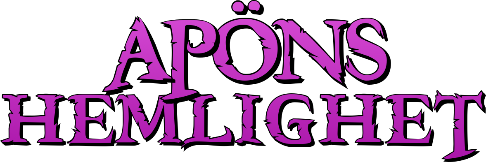

# En svensk fanöversättning av The Secret of Monkey Island™

### OM PATCHEN

Detta är den inofficiella översättningen av spelet till Svenska.
Patchen är i dagsläget endast till för att appliceras mot CD-ROM Talkie-versionen.

Jag rekommenderar att ni spelar det patchade spelet via **ScummVM 2.0 (eller senare)** där man kan justera texthastigheten.
Rekommenderad hastighet är **120 eller över**, då svenskan innehåller mer text än det engelska manuset.

#### BUGGAR
* **Krok-ö-skylten animerar inte som den ska** - Detta beror på att indexeringen tappade en färg från paletten när bilden konverterades till PNG. Detta går att åtgärda, vilket också en vänlig själ på ScummVM-forumen gjort, men jag lyckades inte applicera den patchen. Jag kommer att släppa ny version om jag lyckats få till detta mot 1.0.

---
### HUR MAN INSTALLERAR PATCHEN

#### NOTERA:
1. **Man bör alltid jobba mot nya fräscha filer**, att patcha redan patchade filer *kan* resultera i korrupterad grafik!
2. **Sparfiler använder sig av en checksum mot MONKEY.00X-filerna**, vilket *kan* resultera i att dessa blir obrukbara mot de nya patchade filerna.
Om du redan påbörjat spelet och vill fortsätta på gammal sparfil: Låt oss hoppas på det bästa!

#### GÖR SÅ HÄR:
1. **Ladda hem en IPS-patchare**, till exempel **Lunar IPS** eller **Floating IPS**
2. **Kopiera MONKEY.000 och MONKEY.001** (alternativt MONKEY1.000 och MONKEY1.001
beroende på vilken utgåva av spelet du har) från skivan till hårddisken
3. **Öppna upp respektive patchfil i patchprogrammet och uppdatera originalfilerna**
4. **Starta spelet** och njut!

-------------------------------------------------------------------------------
### VID FELAKTIGHETER ELLER ANDRA BUGGAR
Maila till hellgren.tobias@gmail.com med sparfiler, beskrivning och eventuella rättelser.

-------------------------------------------------------------------------------
### CHANGELOG
v1.0 - 20211113
- Uppdaterat de sista dialograderna

v1.0b3 - 20190106
- Översatt resterande manus
- Åtgärdat en del stavfel, gjort smärre omskrivningar
- Lagt till "Grogg" på animationen då Kajbrusk faller ned i maskinen
- Översatt briggen och källaren på skeppet i del 3 (hade missat dessa)
- Uppdaterat karaktärsuppsättning på set 1 och 6
- Hackat verbruta

v0.33b2 - 20181229 "GOTT NYTT ÅR EDITION"
- Diverse småfix i Del 1
- Översatte klart Del 2
- All grafisk översättning färdig
- Uppdaterade charset med fonetiska bokstäver för ett skämt i Del 2
- Injicerat all ny grafik

v0.165b - 20181226 "GOD JUL EDITION"
- Första release, hela första delen spelbar
